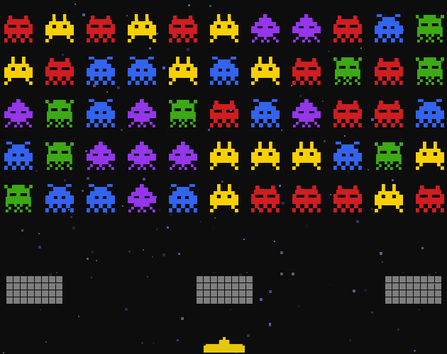

# nebulon monsters

Nebulon Monsters is a simple arcade game inspired by Space Invaders. It features various monsters and dozens of levels with increasing difficulty. Alternatively, you can simply play randomly generated levels for as long as you wish. The first few levels are easy enough even for small children.

  

### Controls

- A,D to move left and right.
- SPACE to fire

Or just use any gamepad


### Install and run
You can download compiled game from the [itch.io](https://mr152here.itch.io/nebulon-monsters) or from the github [releases](https://github.com/mr152here/Nebulon-Monsters/releases). For Linux you will need libraries libSDL2 and libSDL2_mixer from your package manager.

```
cd nebulons
chmod +x NebulonMonsters
./NebulonMonsters
```

If you want to build latest version from the source, clone git repository and compile it with the cargo. You must have installed [rust](https://www.rust-lang.org) programming language to be able to compile it.

```
git https://github.com/mr152here/Nebulon-Monsters.git
cd Nebulon-Monsters
cargo build --release
```

Then copy configuration [config.toml](config.toml) file and whole [assets](assets) folder to the same folder where compiled program is located.


### License

Nebulon Monsters is licensed under the Apache 2.0 license. See the [LICENSE](LICENSE) file for details.
